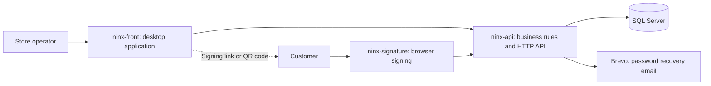

# Ninx

**Sales, inventory, and store credit — connected from checkout to signature.**

Retail management software for small businesses, built around a C#/.NET backend.

[Explore the Repositories](#three-repositories-one-product) · [Features](#what-ninx-does) · [Architecture](#how-it-fits-together) · [Getting Started](#getting-started)

## Built for Everyday Retail

Small retailers need to track more than what leaves the counter. They also need to know what is in stock, who owes what, when payments are due, and who is authorized to buy on a customer's account.

**Ninx brings these workflows together.** It combines a desktop workspace for store operators, a central API for business rules and data, and a browser-based signing experience for customers.

A core focus is **fiado**, the practice of buying now and paying the store later. Ninx connects credit limits, account agreements, purchases, repayments, and electronic signatures so each step belongs to the same business workflow.

## Three Repositories, One Product

| Repository | Purpose | Main technologies |
| --- | --- | --- |
| [**ninx-api**](https://github.com/NinxERP/ninx-api) | Business rules, authentication, store access, persistence, reporting, and document generation. | C#, .NET 10, ASP.NET Core, EF Core, SQL Server |
| [**ninx-front**](https://github.com/NinxERP/ninx-front) | Desktop workspace for sales, inventory, customers, credit, and store administration. | React 19, TypeScript, Tauri 2, Tailwind CSS |
| [**ninx-signature**](https://github.com/NinxERP/ninx-signature) | Customer-facing document review and handwritten electronic signatures in the browser. | JavaScript, HTML, CSS, PDF.js, pdf-lib |

**Start with the API** to explore the backend architecture and business logic. Follow the desktop application to see how those rules support daily operations, then the signing page to trace the customer side of the workflow.

## What Ninx Does

| Area | Capabilities |
| --- | --- |
| **Sales and inventory** | Immediate-payment and credit sales, products, categories, stock movements, and sale reversals. |
| **Customer credit** | Credit limits, due dates, outstanding balances, and repayments for individual or multiple sales. |
| **Account agreements** | Versioned opening agreements, authorized purchasers, purchaser-specific limits, and authorization revocation. |
| **Electronic signatures** | PDF documents, signing links and QR codes, browser signature capture, and stored signing evidence. |
| **Store access** | Multiple stores, store switching, roles with explicit permissions, owner privileges, and global administration. |
| **Reports** | Sales, margins, receivables aging, inventory turnover, customer insights, store comparisons, and Excel export. |
| **Administration** | Audit records, password recovery, subscription records, and desktop application updates. |

The product interfaces use Brazilian Portuguese, with local currency and date formatting.

## How It Fits Together

### From Store Credit to Signed Confirmation

1. **Open the account.** A customer signs an account agreement that defines the credit relationship and authorized purchasers.
2. **Create a credit sale.** The API checks the account agreement and available credit, then generates the document for signing.
3. **Review and sign.** The customer opens a link or scans a QR code, reviews the PDF, and draws a signature without creating an account or installing an app.
4. **Apply the operation.** Signature confirmation records the document and signing metadata, then applies the pending sale's inventory and payment changes.
5. **Follow the balance.** Store staff track outstanding credit and register repayments through the connected document workflow.

<strong>Engineering behind the workflow</strong>

- **Layered backend:** API controllers, application services, domain entities and rules, DTOs, persistence, infrastructure, and dependency composition are separated into .NET projects.
- **Business-focused services:** credit checks, agreement versions, authorized purchasers, and signature-dependent operations are expressed in application services and domain rules.
- **Relational persistence:** EF Core mappings and migrations manage SQL Server data; a unit of work coordinates persistence, with explicit transactions in sale and repayment workflows.
- **Authentication and authorization:** JWTs carry the active store and role context. BCrypt handles password hashing, while backend services enforce permissions and store access.
- **Typed desktop integration:** TypeScript contracts, a shared HTTP client, and TanStack Query connect React screens to the API. Tauri supplies native dialogs, file access, and updates.
- **Document traceability:** the API stores signed PDFs, SHA-256 hashes, signing timestamps, IP addresses, and device information. Signature capture is a handwritten electronic mark embedded in the PDF.

## Quality and Delivery

| Component | Verification | Delivery |
| --- | --- | --- |
| **API** | xUnit tests for services, validation, mappings, and domain rules; SQLite-backed HTTP integration tests for login, sales, signatures, and tenant isolation. | GitHub Actions builds and tests; the deployment workflow publishes a Docker image, applies migrations, and updates Azure Container Apps. |
| **Desktop** | TypeScript checks and Node.js tests for formatting, validation, and sale-flow helpers. | A tag-triggered workflow builds Windows releases and signed updater artifacts. |
| **Signing page** | Manual browser verification; signature business behavior is covered by backend tests. | Azure Static Web Apps deployment and pull-request previews. |

## Getting Started

Each repository contains its own setup instructions, configuration details, and verification commands. To run the complete workflow:

1. **[Set up the API](https://github.com/NinxERP/ninx-api#getting-started).** Configure SQL Server and JWT settings, apply migrations, and start the backend. Authenticated workflows require a provisioned user with store access; migrations do not create a bootstrap account.
2. **[Start the signing page](https://github.com/NinxERP/ninx-signature#getting-started).** Point it at the same API and serve the static files locally.
3. **[Run the desktop application](https://github.com/NinxERP/ninx-front#getting-started).** Configure the API and signing-page URLs, install dependencies, and launch the Tauri application.

The API provides Swagger/OpenAPI documentation. The repository guides also explain local ports, certificates, signing links, and platform prerequisites.

## About the Project

Ninx is the Information Systems capstone project (**Trabalho de Conclusão de Curso — TCC**) of **Matheus Augusto Teixeira Silva**, a developer focused on **C# and .NET**.

The project connects backend engineering to a practical retail problem: modeling business rules, maintaining relational data, controlling access, testing critical workflows, and delivering an integrated desktop and web experience.

## License

The three application repositories do not currently include license files. Refer to each repository for any future licensing updates.

## Author

**Matheus Augusto Teixeira Silva**

[GitHub](https://github.com/maat-aug) · [LinkedIn](https://www.linkedin.com/in/matheus-augusto-a89348265/)
